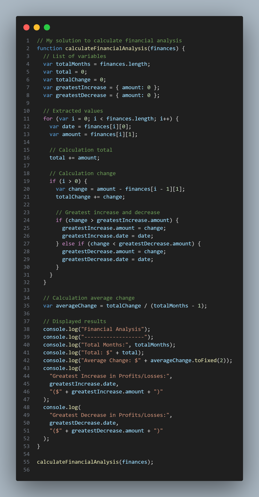

# Console-Finances

## Description

This repository contains JavaScript code that analyzes financial records provided in a dataset. The script calculates various metrics, including the total number of months, net total amount of Profit/Losses, average changes in Profit/Losses, and identifies the greatest increase and decrease in Profit/Losses over a given period.

## Table of Contents

- [Installation](#installation)
- [Usage](#usage)
- [Resources](#resources)
- [Credits](#credits)
- [License](#license)

## Installation

To run this project locally, follow these steps:

1. Clone the GitHub repository to your local machine.
2. Navigate to the project directory.
3. Open the `index.html` file in your preferred web browser.

## Usage

Purpose:
This challenge lets me apply my JavaScript skills in a practical way. I'm tasked with analyzing financial records using JavaScript code, calculating important metrics like total months, net total profit/loss, average changes, and pinpointing the greatest increases and decreases in profit/loss. The aim is to create a JavaScript program that, when run, gives a summary of financial analysis.

Analysis Results

Upon running the script, the console will display a financial analysis summary.

## Resources

I would like to acknowledge the following resources that were instrumental in completing this project:

- [MDN Web Docs](https://developer.mozilla.org/): An invaluable resource for JavaScript documentation and examples.
- [W3Schools](https://www.w3schools.com/): A helpful source for learning and practicing web development concepts.

## Credits

Special thanks to the following:

- [GitHub](https://github.com/): For version control and project hosting.
- [edX](https://www.edx.org/): Learning Platform for providing a valuable learning experience.
  
## License

This project is licensed under the [MIT License](LICENSE).
